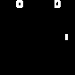

# DQN-atari-pytorch
Pytorch implementation of DQN/DDQN for atari games.

## Requirement
- python 3.6
- pytorch >= 1.0.0
- OpenAI Gym (Atari)
- PIL
- NumPy
- OpenCV

## Run Python Code
```
# Training
python main_pong -t train

# Evaluation
python main_pong -t test
```

## Run on Google Colaboratary
- Login your google drive account and create a “DQN_tutorial/” folder at the outermost directory.
- Put the “dqn_tutorial.ipynb” into the "DQN_tutorial/" folder.
- The model and generated GIF will be saved at "DQN_tutorial/save/" and "DQN_tutorial/gif/" respectively. 

## Demo
After 300k iterations (~1hr on RTX2070). <br><br>
